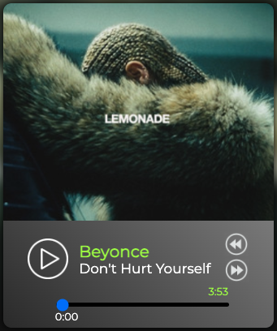

<h1 align="center"> 
  <a href="https://gusap9.github.io/audioplayer/" target="_blank"> Music Player </a>
  <a href="https://gusap9.github.io/audioplayer/" align="right">  </img></a>
</h1>

## About 
Simple music player.

## Peculiarities
Important points:
- user can change/stop song.
- animations during song change.

## Usage
To see the project you can directly visit:

<a href="https://gusap9.github.io/audioplayer/" target="_blank"><code style="margin-left:40px">https://gusap9.github.io/audioplayer/</code></a>

